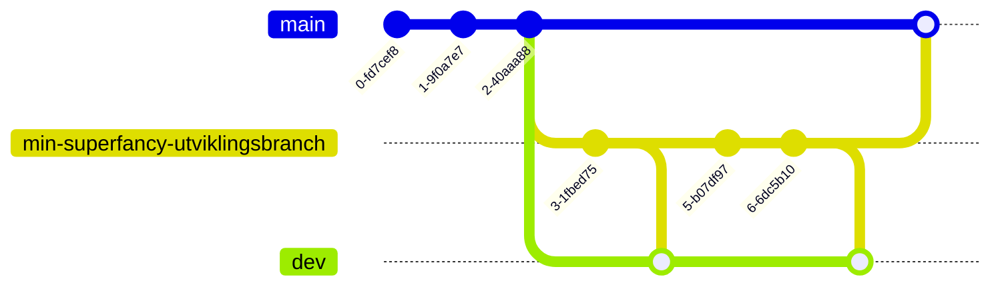

# vdl-airflow

## Miljøer

### prod 
- AirFlow URL: https://vdl.airflow.knada.io
- Git branch: `main`

 ### dev
- AirFlow URL: https://vdl-dev.airflow.knada.io
- Git branch: `dev`

## Git-instrukser

### Før utvikling

All utvikling skjer i egne brancher hvor man merger endringene fra utviklingsbranchen til miljøet man ønsker å kjøre koden (`dev` eller `main`). En typisk arbeidsflyt vill derfor se slik ut:



Stå i `main` branchen.

```
git switch main 
```

Pull endringer i `main`

```
git pull 
```

Opprett egen utviklingsbranch

```
git switch -c min-superfancy-utviklingsbranch
```

### Deploy

Når du ønsker å deploye kode til prod, eller dev må koden pushes til main-branchen for prod eller dev-branchen for dev. 

```
git switch <main/dev>
```

```
git pull 
```

```
git merge `<utviklingsbranch>`
```

```
git push
```

