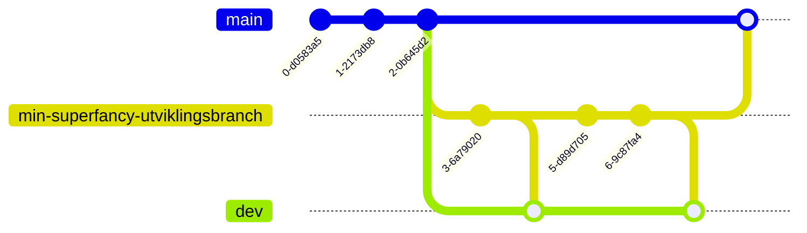

# vdl-airflow

## Lokal utvikling

Kjør `make install` for å installere lokalt.

```shell
make install
```

## Snowbird

Bruk `run_snowbird.sh` for å kjøre snowbird.

```shell
./infrastructure/run_snowbird.sh
```

## Miljøer

### prod
- AirFlow URL: https://vdl.airflow.knada.io
- Git branch: `main`

 ### dev
- AirFlow URL: https://vdl-dev.airflow.knada.io
- Git branch: `dev`

## Utvikling

All utvikling skjer i egne brancher hvor man merger endringene fra utviklingsbranchen til miljøet man ønsker å kjøre koden (`dev` eller `main`). En typisk arbeidsflyt vill derfor se slik ut:



### Starte utvikling

```shell
make development_branch
```

### Deploy

Når du ønsker å deploye kode til prod, eller dev må koden pushes til main-branchen for prod eller dev-branchen for dev.

```shell
make deploy
```
